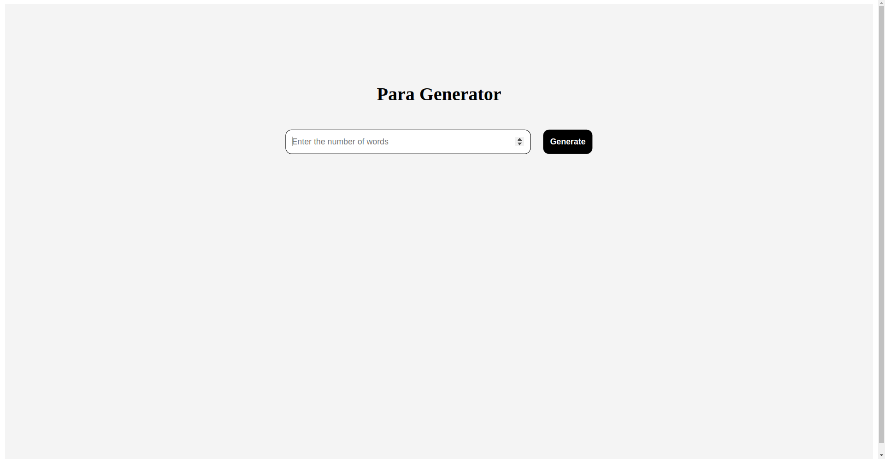
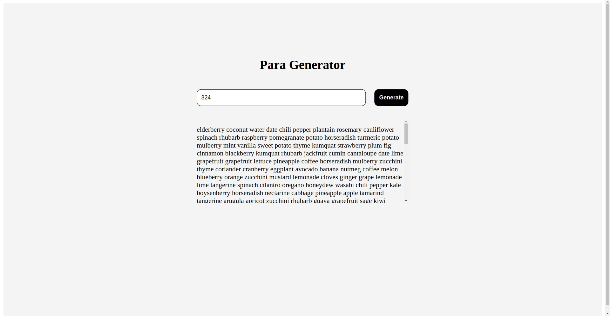

# Para Generator

I have created a simple React application called Para Generator for practicing purposes. It generates a paragraph based on the number input provided by the user.

## How to Use

1. Clone this repository to your local machine.
2. Navigate to the project directory.
3. Ensure you have Node.js and npm installed on your machine.
4. Run `npm install` to install dependencies.
5. Run `npm run dev` to start the development server.
6. Input a number in the text field.
7. Click on the "Generate" button.
8. View the generated paragraph below the input field.

## Screenshots

Feel free to explore the code and modify it according to your needs!

### Note

This project is a simple demonstration created solely for practicing React and Vite. It does not have any additional functionality beyond generating paragraphs based on user input.
